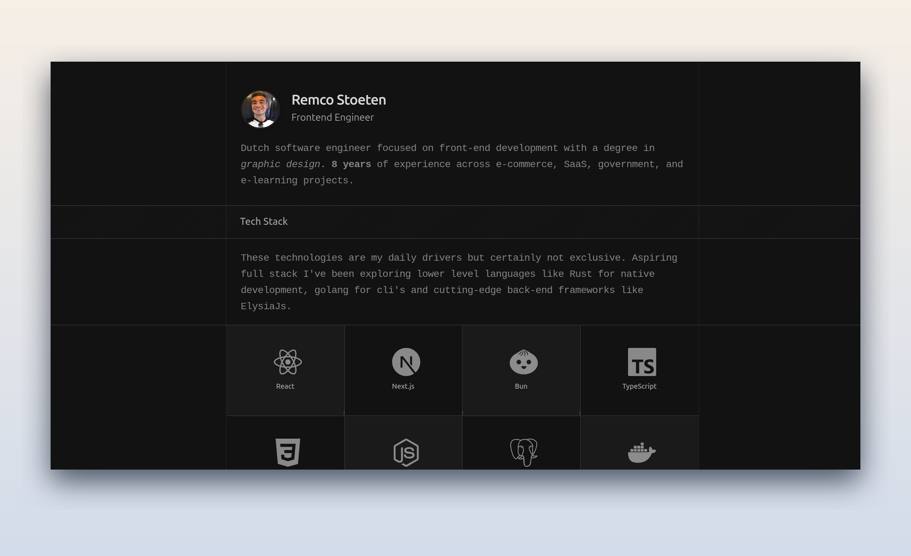

# remcostoeten.nl

Source for [remcostoeten.nl](https://remcostoeten.nl), a personal website built with Next.js.  
It combines a portfolio-style marketing site, an MDX blog, a protected admin area, and a small activity system that pulls GitHub and Spotify data into Postgres.



## What this project includes

- A homepage with work experience, featured projects, and personal profile content
- A filesystem-based MDX blog with topics, RSS, syntax highlighting, and draft support
- An admin area for managing project visibility and internal content workflows
- GitHub and Spotify integrations for recent activity and listening data
- A contact flow backed by server actions and database persistence
- Optional analytics and email integrations for production deployments

## Stack

- Next.js 16, React 19 and TypeScript
- Tailwind v4
- Drizzle ORM + Postgres cloud (neon.tech)
- GitHub OAuth (better-auth)
- oxlint/oxfmt

- PostHog, Vercel Analytics, GitHub API, Spotify API

## Requirements

- Node.js `24.x`
- Bun
- A Postgres database

## Quick Start

1. Clone the repository

```bash
git clone https://github.com/remcostoeten/remcostoeten.nl.git
cd remcostoeten.nl
```

2. Install dependencies

```bash
bun install
```

3. Create your local environment file

```bash
cp .env.example .env.local
```

4. Fill in the minimum required variables in `.env.local`

```bash
DATABASE_URL="<https://neon.tech>"
BETTER_AUTH_URL="http://localhost:3000"
BETTER_AUTH_SECRET="<random string>"
```

5. Push the schema to your database

```bash
bun drizzle-kit push
```

6. Start the development server

```bash
bun run dev
```

Open `http://localhost:3000`.

## Environment Variables

Required for a basic local setup:

- `DATABASE_URL`
- `BETTER_AUTH_URL`
- `BETTER_AUTH_SECRET`

Optional, depending on which features you want enabled:

- `GITHUB_CLIENT_ID`, `GITHUB_CLIENT_SECRET` for GitHub OAuth
- `GOOGLE_CLIENT_ID`, `GOOGLE_CLIENT_SECRET` for Google OAuth
  - `GITHUB_TOKEN` for server-side GitHub API access
- `SPOTIFY_CLIENT_ID`, `SPOTIFY_CLIENT_SECRET`, `SPOTIFY_REFRESH_TOKEN`, `SPOTIFY_REDIRECT_URI` for Spotify data
- `IP_INFO_TOKEN` for IP geolocation https://ipinfo.io/
- `CRON_SECRET` for protected sync endpoints
  <small>💡 For automated GitHub (and Google) OAuth creation view <a target="_blank" href="https://github.com/remcostoeten/oauth-app-automator">OAuth App Automator</a></small>

If an optional integration is missing, the related feature will be limited or disabled rather than preventing the whole app from running.

## Scripts

```bash
npm run dev
npm run lint
npm run typecheck
npm run test
npm run test:watch
npm run test:coverage
npm run check
npm run build
npm run build:next
```

## Release Gate

- `npm run check` runs linting, type-checking, and Vitest.
- `npm run build` now shows a staged release overview for lint, typecheck, tests, and the production build.
- CI runs the same gate on pull requests and pushes to `master`.

The raw Next.js build remains available as `npm run build:next`.

## Project Structure

```text
src/
  app/               App Router routes, API routes, metadata, RSS, sitemap
  components/        UI, blog, admin, layout, and interaction components
  features/          Filesystem blog logic and client-side feature modules
  server/
    actions/         Server actions grouped by domain
    db/              Drizzle connection, schema, migrations, helpers
    github/          GitHub access and activity sync logic
    spotify/         Spotify retrieval and sync logic
    request/         Request-scoped helpers
    security/        Environment-specific access guards
```

Blog content lives in `src/app/(marketing)/blog/posts`.

## Architecture Notes

- Server code stays under `src/server` to keep runtime boundaries explicit.
- API routes are intentionally thin and delegate work to server domains or actions.
- Blog posts are read from the filesystem, parsed from frontmatter, and enriched with derived metadata like topic and reading time.
- Draft visibility is enforced in the blog layer so unpublished posts stay private to authorized users.

## License

[MIT](./LICENSE)
