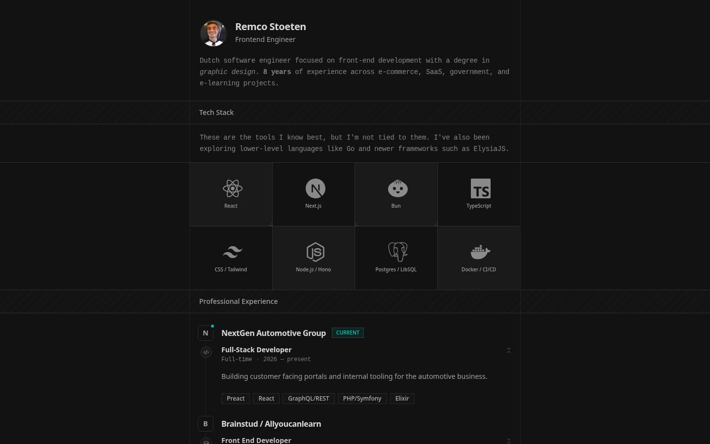

<div align="center">

# remcostoeten.nl

<a href="https://remcostoeten.nl"></a>

**My corner of the internet.** Part portfolio, part blog, part playground for ideas
I want to ship before I talk myself out of them.

[**→ Visit the live site**](https://remcostoeten.nl) &nbsp;·&nbsp; [Read the blog](https://remcostoeten.nl/posts) &nbsp;·&nbsp; [About me](https://remcostoeten.nl/about)

<a href="https://shieldcn.dev/github/stars/remcostoeten/remcostoeten.nl.svg"></a>
<a href="https://github.com/remcostoeten/remcostoeten.nl/commits"></a>
<a href="./LICENSE"></a>

</div>

---

It started as a place to park a CV and quietly grew into a small system: an MDX blog,
a GitHub + Spotify activity feed, an admin area, and a pile of things I built mostly
because I was curious whether I could. The code is open — poke around, steal what's useful.

---

## Stack

| Layer        | Tech                                               |
| ------------ | -------------------------------------------------- |
| Framework    | Next.js 16 (App Router)                            |
| Language     | TypeScript 5.9                                     |
| Styling      | Tailwind v4                                        |
| Database     | Drizzle ORM + Neon Postgres                        |
| Auth         | better-auth (GitHub + Google OAuth)                |
| Blog         | MDX (filesystem-based, next-mdx-remote)            |
| Integrations | GitHub API, Spotify API, PostHog, Vercel Analytics |
| Tooling      | Bun, oxlint, oxfmt, Vitest                         |

## Features

- **Marketing / home**: work history, featured projects, profile
- **Blog**: MDX posts with topics, reading time, RSS, syntax highlighting, draft support
- **Search**: full client-side search across blog posts
- **Admin area**: manage project visibility and content workflows (GitHub OAuth gated)
- **Activity feed**: syncs GitHub commits and Spotify listening data into Postgres via cron
- **Contact**: server action backed, persisted to database
- **OG images**: dynamic edge-rendered open graph images
- **Analytics**: PostHog + Vercel Analytics + Speed Insights

## Project structure

```
src/
├── app/
│   ├── (admin)/         # protected admin routes
│   ├── (auth)/          # sign-in / callback
│   ├── (marketing)/     # public-facing pages
│   ├── api/             # thin API route handlers
│   └── og/              # OG image generation
├── components/          # shared UI components
├── core/                # analytics, config, metadata
├── features/            # domain modules (auth, blog, github, spotify)
├── server/              # DB, queries, actions, security (never imported client-side)
├── shared/lib/          # utilities shared across server + client
└── views/               # page-level view components
```

## Getting started

**Requirements:** Node.js `24.x`, Bun

```bash
git clone https://github.com/remcostoeten/remcostoeten.nl.git
cd remcostoeten.nl
bun install
cp .env.example .env.local
```

Fill in the required env vars (see below), then:

```bash
bun db:push      # push schema to your database
bun dev          # start dev server -> http://localhost:3000
```

## Environment variables

**Required**

```env
DATABASE_URL=
BETTER_AUTH_URL=http://localhost:3000
BETTER_AUTH_SECRET=
```

**Optional** (features degrade gracefully when missing)

```env
# OAuth providers
GITHUB_CLIENT_ID=
GITHUB_CLIENT_SECRET=
GOOGLE_CLIENT_ID=
GOOGLE_CLIENT_SECRET=

# Integrations
GITHUB_TOKEN=              # server-side GitHub API
SPOTIFY_CLIENT_ID=
SPOTIFY_CLIENT_SECRET=
SPOTIFY_REFRESH_TOKEN=
SPOTIFY_REDIRECT_URI=

# Infrastructure
IP_INFO_TOKEN=             # ipinfo.io geolocation
CRON_SECRET=               # protects sync endpoints
```

> Tip: automate GitHub/Google OAuth app creation with [oauth-app-automator](https://github.com/remcostoeten/oauth-app-automator).

## Scripts

```bash
bun dev               # development server
bun run build:next    # production build
bun test              # run tests
bun run check         # lint + typecheck + test
bun db:generate       # generate Drizzle migrations
bun db:push           # push schema
bun db:studio         # Drizzle Studio
bun run lint:fix      # auto-fix lint errors
bun run format:fix    # auto-format
```

## License

[MIT](./LICENSE)
